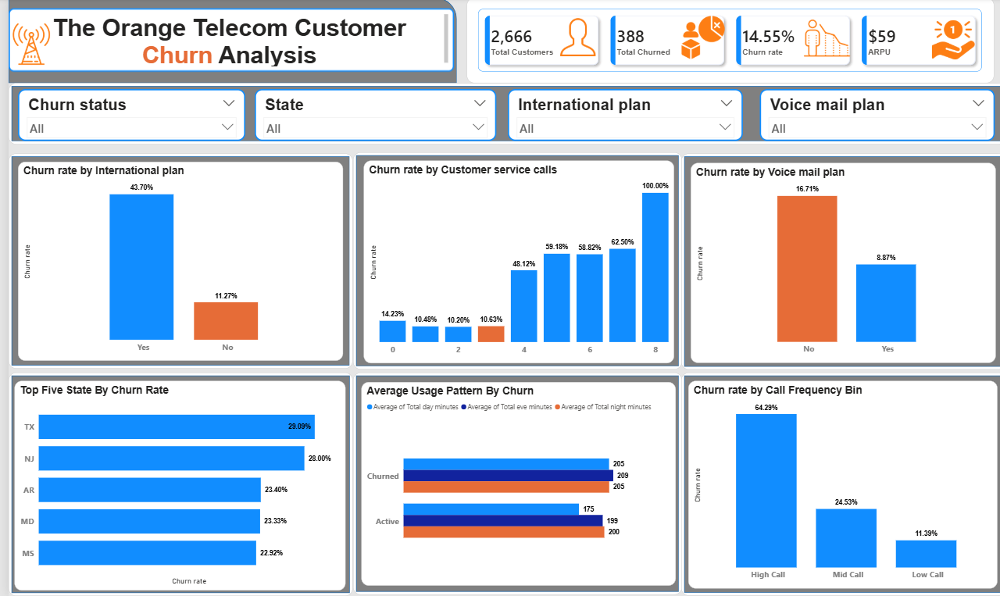

# Telecom Customer Churn Analysis

## Project Overview
The objective of this project was to transform raw telecom customer data into meaningful business insights using  interactive dashboards in Power BI.  

The project focuses on identifying patterns that influence **customer churn**, including service subscriptions, customer complaints, usage behavior, and customer tenure.  

Two dashboards were created to explore:
- **Churn drivers**
- **Customer behavior patterns**

The final dashboards present key metrics and trends to support **data-driven decision making for telecom customer retention strategies.**

**Disclaimer:**  
All datasets and reports do not represent any company, institution, or country. They are **dummy datasets used solely to demonstrate Power BI data analysis and visualization capabilities.**

---

# Data Sources
This project uses a telecom churn dataset stored as a CSV file containing customer-level information about telecom usage and services.

The dataset includes the following key variables:

### Customer Information
- State
- Area Code
- Account Length

### Service Plans
- International Plan
- Voice Mail Plan

### Usage Metrics
- Total Day Minutes  
- Total Evening Minutes  
- Total Night Minutes  
- Total International Minutes  

### Call Metrics
- Total Day Calls  
- Total Evening Calls  
- Total Night Calls  
- Total International Calls  

### Charges
- Total Day Charge  
- Total Evening Charge  
- Total Night Charge  
- Total International Charge  

### Customer Interaction
- Customer Service Calls

### Target Variable
- Churn (True/False)

---

# Problem Statement
The analysis aims to answer the following business questions:

- Do international plan users churn more?
- Do customer service complaints increase churn?
- Does voicemail plan affect churn?
- Does voicemail plan affect churn?
- Do heavy users churn more?
- Do heavy users churn more?
- Do frequent callers churn more?
- How often do customers contact support?
- How common are telecom service features?
- What are the call patterns during the day?
- Is billing proportional to usage?

---

# Key Skills Demonstrated

### Power Query
- Data cleaning and transformation  
- Feature creation and column engineering  

### Data Modeling
- Structuring datasets for analysis  
- Creating calculated columns  

### DAX
- Calculated columns and measures including:
  - Churn Rate
  - Average Revenue Per User (ARPU)
  - Total Minutes
  - Total Charges
  - Call Frequency Bins
  - Account Length Bins

### Power BI
- Interactive dashboards  
- Business-focused data visualization  
- Slicers and filters for user interaction  

---

Several calculated fields were created to enhance the analysis:

### Calculated Columns

**Total Minutes**  
Sum of total day minutes, total evening minutes and total night minutes:

**Total Charges**  
Sum of total day charge, total evening charge and total night charge:

**Call Frequency Bin**
- Low Call
- Mid Call
- High Call

**Account Length Bin (Customer Tenure)**
- Short-Term Customers
- Mid-Term Customers
- Long-Term Customers

These features help segment customers for deeper behavioral analysis.

---

# Visualization

Two dashboards were designed in Power BI to present insights from different analytical perspectives.

---

## Dashboard 1: Telecom Customer Churn Analysis

This dashboard focuses on identifying **key drivers of customer churn**.

### Key Visuals

**Cards**

- Total Customers
- Total Churned Customers
- Churn Rate
- Average Revenue Per User (ARPU)

**Column Chart**
- Churn Rate by International Plan

**Column Chart**
- Churn Rate by Customer Service Calls

**Column Chart**
- Churn Rate by Voice Mail Plan

**Bar Chart**
- Top 5 States by Churn Rate

**Clustered Bar Chart**
- Average Usage Pattern of Churned vs Active Customers

**Column Chart**
- Churn Rate by Call Frequency Bin

### Slicers for Interactivity
- Churn
- State
- International Plan
- Voice Mail Plan

---

## Dashboard 2: Telecom Customer Behaviour Analysis

This dashboard focuses on understanding **customer usage behavior and service adoption patterns**.

### Key Visuals

**Cards**
- Total Customers
- Total Minutes
- Total Charges
- Average Account Length

**Column Chart**
- Customer Distribution by Account Length (Tenure)

**Bar Chart**
- Distribution of Customer Service Calls

**Donut Charts**
- Voice Mail Plan Adoption
- International Plan Adoption

**Clustered Column Chart**
- Average Calls by Time of Day

**Scatter Plot**
- Total Minutes vs Total Charges

### Slicers for Interactivity
- State
- Churn
- Call Frequency Bin
- Account Length Bin

---

# Analysis

The analysis was performed using Power BI and focused on identifying **churn drivers and customer usage patterns**.

## Data Cleaning & Preparation

The following preprocessing steps were performed:

- Checked and corrected data types
- Handled missing values where necessary
- Created additional calculated columns including:

### 1. Total Minutes
Combined all call minute columns to measure overall customer usage.

### 2. Total Charges
Combined all charge columns to analyze total telecom billing.

### 3. Call Frequency Bins
Customers were categorized based on total call activity.

### 4. Account Length Bins
Customers were grouped based on their tenure.

---

## Data Exploration

The dataset was explored to uncover patterns related to:

- Customer churn behavior
- Service adoption
- Customer complaints
- Usage patterns
- Billing relationships

Visualizations such as bar charts, column charts, and scatter plots were used to identify trends and relationships within the data.

---

# Key Findings

- The dataset contains **2,666 customers**, with **388 customers churning**, resulting in a **14.55% churn rate**.

- Customers with an **International Plan churn significantly more (43.7%)** than customers without the plan (11.27%).

- Customers who made **multiple customer service calls show dramatically higher churn rates**, indicating dissatisfaction with service support.

- Customers **without a Voice Mail Plan churn almost twice as much** as those with the plan.

- Certain states such as **Texas and New Jersey show the highest churn rates**.

- Customers with **high call frequency demonstrate the highest churn risk**, suggesting heavy users may be more sensitive to service quality or pricing.

- A **strong linear relationship exists between total minutes and total charges**, confirming that telecom billing is directly proportional to usage.

---

# Recommendations

Based on the insights from the analysis, the following strategies are recommended:

### Improve Customer Support Experience
Customers making multiple service calls are more likely to churn. Improving **issue resolution speed and support quality** may reduce churn.

### Review International Plan Strategy
The high churn rate among international plan users suggests potential issues with **pricing, service quality, or perceived value**.

### Promote Value-Added Services
Customers with voice mail plans show **lower churn rates**, indicating that bundled services may improve retention.

### Identify High-Risk Customers Early
Customers with **high call frequency and frequent complaints** should be flagged for proactive retention strategies.

### Target High-Churn Regions
Regions with higher churn rates should receive **focused marketing campaigns and service improvements**.

---
