# Telecom Customer Churn Analysis

## Project Overview
The objective of this project was to transform raw telecom customer data into meaningful business insights using  interactive dashboards in Power BI.  

The project focuses on identifying patterns that influence **customer churn**, including service subscriptions, customer complaints, usage behavior, and customer tenure.  

Two dashboards were created to explore:
- **Churn drivers**
- **Customer behavior patterns**

The final dashboards present key metrics and trends to support **data-driven decision making for telecom customer retention strategies.**

---

# Data Sources
This project uses a telecom churn dataset stored as a CSV file containing customer-level information about telecom usage and services.

The dataset includes the following key variables:

### Customer Information
- State
- Area Code
- Account Length

### Service Plans
- International Plan
- Voice Mail Plan

### Usage Metrics
- Total Day Minutes  
- Total Evening Minutes  
- Total Night Minutes  
- Total International Minutes  

### Call Metrics
- Total Day Calls  
- Total Evening Calls  
- Total Night Calls  
- Total International Calls  

### Charges
- Total Day Charge  
- Total Evening Charge  
- Total Night Charge  
- Total International Charge  

### Customer Interaction
- Customer Service Calls

### Target Variable
- Churn (True/False)

---

# Problem Statement
The analysis aims to answer the following business questions:

- Do international plan users churn more?
- Do customer service complaints increase churn?
- Does voicemail plan affect churn?
- Does voicemail plan affect churn?
- Do heavy users churn more?
- Do heavy users churn more?
- Do frequent callers churn more?
- How often do customers contact support?
- How common are telecom service features?
- What are the call patterns during the day?
- Is billing proportional to usage?

---

# Key Skills Demonstrated

### Power Query
- Data cleaning and transformation  
- Feature creation and column engineering  

### Data Modeling
- Structuring datasets for analysis  
- Creating calculated columns  

### DAX
- Calculated columns and measures including:
  - Churn Rate
  - Average Revenue Per User (ARPU)
  - Total Minutes
  - Total Charges
  - Call Frequency Bins
  - Account Length Bins

### Power BI
- Interactive dashboards  
- Business-focused data visualization  
- Slicers and filters for user interaction  

---

# Analysis

The analysis was performed using Power BI and focused on identifying **churn drivers and customer usage patterns**.

## Data Cleaning & Preparation

The following preprocessing steps were performed:

- Checked and corrected data types
- Handled missing values where necessary
- Created additional calculated columns including:

### 1. Total Minutes
Sum of total day minutes, total evening minutes and total night minutes

### 2. Total Charges
Sum of total day charge, total evening charge, total night charge and total international charge:

### 3. Call Frequency Bins
Customers were categorized based on total call activity.
- Low Call
- Mid Call
- High Call
  
### 4. Account Length Bins
Customers were grouped based on their tenure.
- Short-Tenure Customers
- Mid-Tenure Customers
- Long-Tenure Customers

---

## Data Exploration

The dataset was explored to uncover patterns related to:

- Customer churn behavior
- Service adoption
- Customer complaints
- Usage patterns
- Billing relationships

Visualizations such as bar charts, column charts, and line charts were used to identify trends and relationships within the data.

---

# Visualization and Key Questions Answered

Two dashboards were designed in Power BI to present insights from different analytical perspectives.

---

## Dashboard 1: Telecom Customer Churn Analysis

This dashboard focuses on identifying **key drivers of customer churn**.

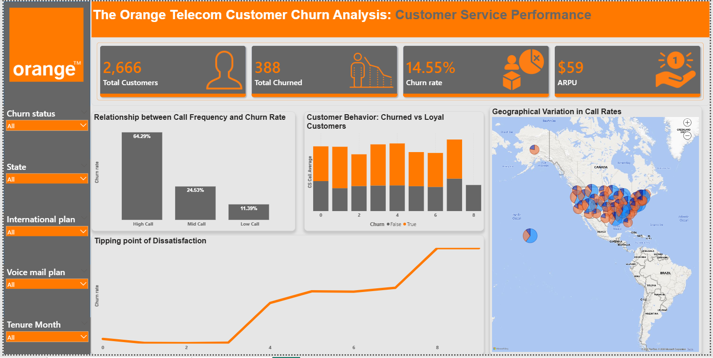

### Key Visuals

**Cards**

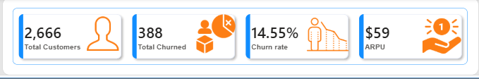

- Total Customers
- Total Churned Customers
- Churn Rate
- Average Revenue Per User (ARPU)

## WHAT IS THE OVERALL CUSTOMER CHURN RATE?

Out of 2,666 total customers, **388 customers churned**, resulting in a **14.55% churn rate**.

This indicates that roughly **1 in every 7 customers leaves the telecom service**, highlighting the need for targeted retention strategies.

## DO CUSTOMERS WITH INTERNATIONAL PLANS CHURN MORE?

- 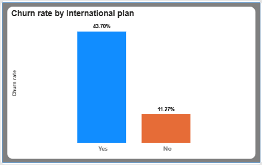

- Customers with an **International Plan recorded a churn rate of 43.7%**, which is significantly higher than customers without the plan.

- Customers without an international plan had a churn rate of **11.27%**.

This suggests that **international plan users are far more likely to churn**, possibly due to pricing concerns or dissatisfaction with service value.

## DOES CUSTOMER SERVICE INTERACTION INFLUENCE CHURN?

- 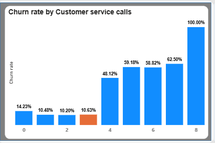

- Customers who made **multiple customer service calls showed significantly higher churn rates**.

- Churn remained relatively low for customers with **0–2 service calls**, but increased sharply as the number of complaints rose.

- Customers with **8 customer service calls recorded a 100% churn rate**, indicating extremely high dissatisfaction levels.

- This suggests that **frequent service complaints are one of the strongest indicators of churn risk**.

## DOES HAVING A VOICE MAIL PLAN REDUCE CHURN?

- 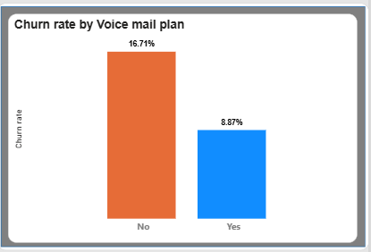

- Customers **without a Voice Mail Plan recorded a churn rate of 16.71%**.

- Customers who subscribed to the **Voice Mail Plan had a much lower churn rate of 8.87%**.

- This suggests that **value-added services like voicemail may improve customer retention**.

## WHICH STATES HAVE THE HIGHEST CHURN RATES?

- 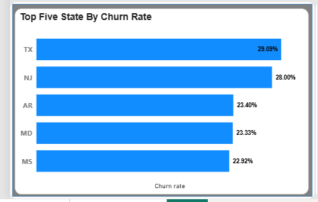

Texas recorded the **highest churn rate at 29.09%**.

New Jersey had the **second highest churn rate at 28%**, followed by Arkansas (23.40%), Maryland (23.33%), and Mississippi (22.92%).

This indicates that **customer churn varies across regions**, suggesting the need for location-specific retention strategies.

 ## WHAT ARE THE USAGE PATTERNS OF CHURNED VS ACTIVE CUSTOMERS?

- 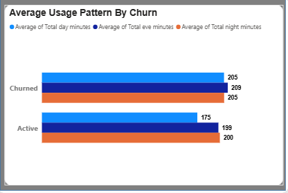

- Churned customers recorded **higher average usage minutes** compared to active customers across most time periods.

- For example:Average **Evening Minutes for churned customers was 209 minutes**, compared to **199 minutes for active customers**.

- This suggests that **customers with higher usage levels may have different expectations regarding service value and pricing**.

## DO CUSTOMERS WITH HIGH CALL FREQUENCY CHURN MORE?

- 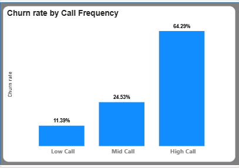

- Customers categorized under **High Call Frequency recorded the highest churn rate at 64.29%**.

- Mid-frequency callers had a churn rate of **24.53%**, while low-frequency callers had the lowest churn rate at **11.39%**.

- This suggests that **heavy telecom users may be more sensitive to pricing or service quality issues**.

---

## Dashboard 2: Telecom Customer Behaviour Analysis

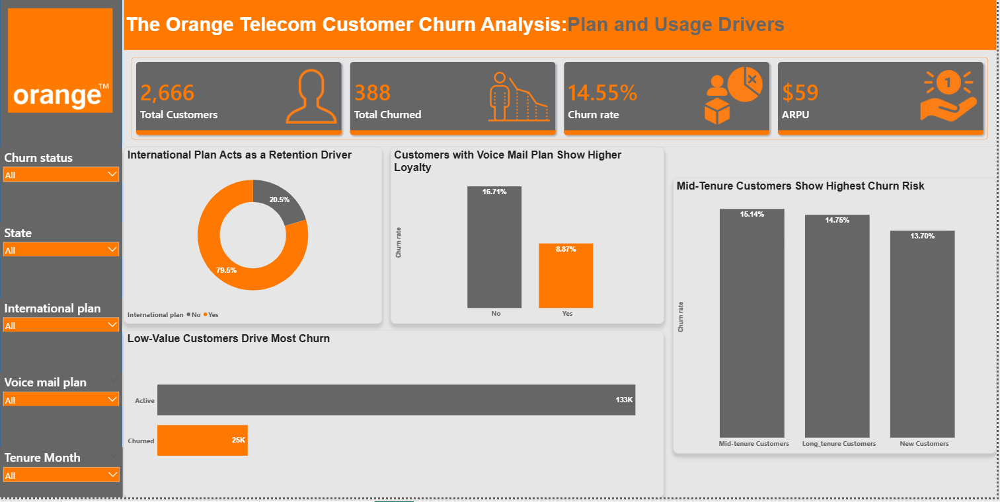

This dashboard focuses on understanding **customer usage behavior and service adoption patterns**.

## HOW ARE CUSTOMERS DISTRIBUTED BY ACCOUNT LENGTH?

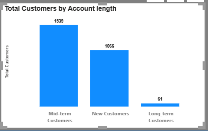

- Most customers fall within the **mid-term account length category (1,539 customers)**.

- New customers account for **1,066 customers**, while **long-term customers represent only 61 customers**.

- This suggests that the customer base is largely composed of **mid-tenure customers rather than long-term loyal customers**.

---

## HOW OFTEN DO CUSTOMERS CONTACT CUSTOMER SUPPORT?

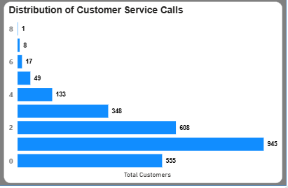

- Most customers made **between 0 and 2 customer service calls**, indicating relatively low interaction with support services.

- A smaller number of customers recorded **4 or more service calls**, suggesting potential service issues or dissatisfaction for that group.

- This distribution helps identify **customers who may be experiencing service challenges**.

---

## HOW MANY CUSTOMERS SUBSCRIBE TO THE VOICE MAIL PLAN?

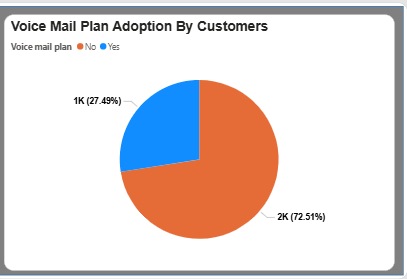

- The majority of customers **do not subscribe to the Voice Mail Plan**.

- Approximately **2,000 customers (72.5%) do not have the plan**, while about **1,000 customers (27.5%) have the Voice Mail Plan**.

- This indicates that **value-added telecom services are adopted by only a minority of customers**.

---

## HOW MANY CUSTOMERS USE THE INTERNATIONAL PLAN?

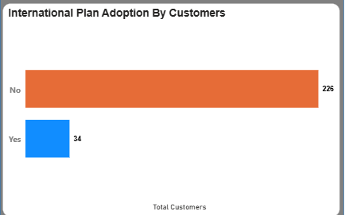

- Only **34 customers subscribe to the International Plan**, while **226 customers do not have the plan**.

- This shows that **international service adoption is relatively low among the customer base**.

- The low adoption rate may reflect **limited demand or higher pricing for international calling services**.

---

## WHAT ARE THE CUSTOMER CALL PATTERNS BY TIME OF DAY?

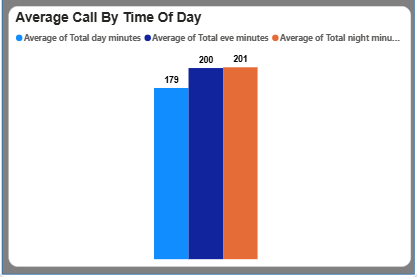

Average call minutes are relatively balanced across the different time periods.

Customers recorded an average of:

- **179 minutes during the day**
- **200 minutes during the evening**
- **201 minutes during the night**

This suggests that **customer usage is fairly evenly distributed throughout the day**, with slightly higher activity during evening and night periods.

---

## IS THERE A RELATIONSHIP BETWEEN TOTAL MINUTES AND TOTAL CHARGES?

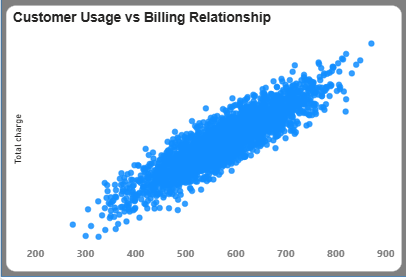

The scatter plot shows a **strong positive relationship between total minutes used and total telecom charges**.

Customers with higher call usage consistently incur **higher telecom charges**.

This confirms that **telecom billing increases proportionally with customer usage**, which aligns with expected pricing structures.

---

# Key Insights & Findings

- The telecom dataset contains **2,666 customers**, with **388 customers churning**, resulting in an overall **churn rate of 14.55%**.

- Customers subscribed to the **International Plan recorded the highest churn rate (43.7%)**, significantly higher than customers without the plan.

- Customers who made **frequent customer service calls showed a much higher likelihood of churning**, indicating that repeated complaints strongly influence customer attrition.

- Customers **without a Voice Mail Plan churn almost twice as much as those with the plan**, suggesting that value-added services may help improve retention.

- **Texas and New Jersey recorded the highest churn rates**, followed by Arkansas, Maryland, and Mississippi, showing that churn varies across states.

- Customers categorized under **High Call Frequency recorded the highest churn levels**, indicating that heavy telecom users may be more sensitive to pricing or service quality.

- The majority of customers fall within the **mid-term account length category**, while **long-term customers represent a small portion** of the customer base.

- Most customers made **between 0 and 2 customer service calls**, suggesting relatively low interaction with customer support for the majority of users.

- **Voice Mail Plan adoption is relatively low**, with most customers not subscribing to the service.

- **International Plan adoption is also very low**, indicating that only a small portion of customers require international calling services.

- Customer call activity is **fairly balanced across day, evening, and night periods**, with slightly higher usage during evening and night hours.

- A **strong positive relationship exists between total call minutes and total charges**, confirming that telecom billing increases proportionally with customer usage.

---

# Recommendations

Based on the insights from the analysis, the following strategies are recommended:

### Improve Customer Support Experience
Customers making multiple service calls are more likely to churn. Improving **issue resolution speed and support quality** may reduce churn.

### Review International Plan Strategy
The high churn rate among international plan users suggests potential issues with **pricing, service quality, or perceived value**.

### Promote Value-Added Services
Customers with voice mail plans show **lower churn rates**, indicating that bundled services may improve retention.

### Identify High-Risk Customers Early
Customers with **high call frequency and frequent complaints** should be flagged for proactive retention strategies.

### Target High-Churn Regions
Regions with higher churn rates should receive **focused marketing campaigns and service improvements**.

---
[Click here to access the project files](https://drive.google.com/drive/folders/18LPyWgWpHx085tZsBbiDlerL-axdL_9f?usp=sharing)
